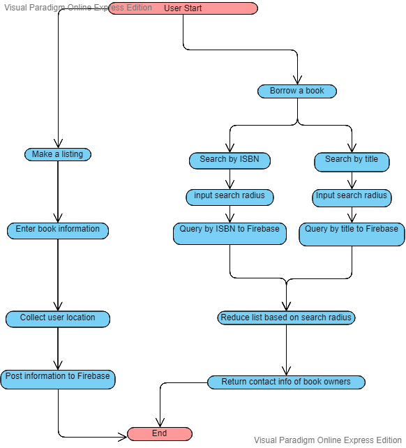
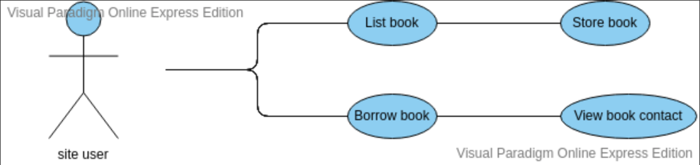
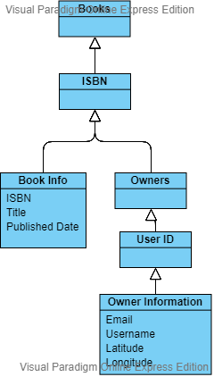

# shelf

## https://shelf-1.appspot.com/home.html

shelf is a web app designed to streamline the process of borrowing books within a community. Communities tied together through school, religion, location, or any other shared interests can now consolidate a massive crowd-sourced library of media to share between each other.

## Getting Started

These instructions will get you a copy of the project up and running on your local machine for development and testing purposes. See deployment for notes on how to deploy the project on a live system.

### Prerequisites

What things you need to install the software and how to install
them

```
This project requires jsdoc for the documentation and python flask
for server-side hosting.
Requirements can be found in the requirrements.txt file in the root directory.
```

### Installing

A step by step series of examples that tell you how to get a development env running

Install the necessary python libraries

```
python3 -m pip install -r requirements.txt
```

then modify the port at the bottom of server.py as needed

and start up the server

```
python3 server.py
```

## Building the docs

Building the docs is as easy as running

```
jsdoc -c config.json
```

from the root directory

docs will be built in "static/docs/" directory and can be accessed through

```
example.com/docs/
```

## Deployment

For deployment to a live system make sure to turn flask debug mode off

## Testing

must have newman installed
to install:
```
npm install -g newman
```
and run:
```
newman run shelfTest.postman_collection.json
```

## Built With

* [Flask](http://flask.pocoo.org) - The backend server used
* [Firebase](https://firebase.google.com/docs/) - The storage method
* [JsDoc3](http://usejsdoc.org) - Used to generate autodocumentation

## Authors

* **Andre Kurait** - *Andre
served as scrum master, handling documentation requirements as well as code validation and testing. Andre also solved many bugs with the various backend systems used that arose. Most importantly, Andre designed the cowsay logo. * - [AndreKurait](https://github.com/AndreKurait)

* **Michael Svoren** - *Michael helped implement the Firebase for use in shelf. Additionally, he generated book info from an isbn number and was responsible for formatting the output when a user borrows. He worked to clean and beautify several html pages as well. Finally, Michael ideated the storage structure in the database. For project 4, Michael implemented the geolocation feature as well as the search within a certain radius functionality.* - [mdsvoren](https://github.com/mdsvoren)

* **Nathan Nichols** - *Nathan helped develop the front end html and css. He was instrumental in achieving the premium feel that shelf wants to achieve. Nathan also stepped in to fix back end server issues when needed, proving invaluable there. He also implemented all tests.* - [natenichols](https://github.com/natenichols)

* **Colin Floyd** - *Colin labored primarily on the on the front end html and css. He realized the modern minimalistic design while still enabling the smooth core functionality. Colin also handled the flow of information to the javascript file and then from there posted to the server to be handled in the python. * - [czfloyd](https://github.com/czfloyd)

* **Tiernon Riesenmy** - *Tiernon masterminded the firebase implementation of firebase for the database. He wrote the abilities to read and write from the database, also overcoming major obstacles faced in getting the returned data all the way back to the JS file. Tiernon also helped make the site more robust, by adding in fail safes to bad in put or misinterpreted information by the api calls.* - [TiernonRR](https://github.com/TiernonRR)

## License

This project is licensed under the MIT License

# Build Process


## Gantt Chart

You can find the most up to date gantt chart used [here](https://docs.google.com/spreadsheets/d/1LpeLnEP7ImVL90qSGQHIsktWfbXGHQE5Drwao6LR-2w/edit?usp=sharing)


## Scrum Artifacts

You can find the Product Backlog [here](https://docs.google.com/spreadsheets/d/1T_-BsET3-Mhd6G8vbVHBQqs77u45WcXDNMd-9sdvAjQ/edit?usp=sharing)

You can find the Sprint Backlog [here](https://docs.google.com/spreadsheets/d/1ktC6fxbPKud45chsLSqZ9oB99sTQhaG9CjEtAdsIe-s/edit?usp=sharing)

## Meeting Documentation

3/26/19
Meeting Attendees: All
Location: Spahr Library
Objective: Solidify project purpose and divide tasks
Conclusion: Reached shelf idea and mission, divided tasks among 5 team members

4/2/19
Meeting Attendees: All
Location: Spahr Library
Objective: Figure out interaction between front and back end
Conclusion: Determined json structure and clarified utilization of http. Finished front end template.

4/9/19
Meeting Attendees: All (at various times)
Location: Google Hangouts
Objective: Finish MVP
Conclusion: Finished MVP, overcame bugs revolving around the server in development mode as well as bizzare returned objects from firestore. Figured out how to interpret returned documents and display to user.

Much of our communication was done through Slack throughout the weeks that we invested ourselves on this project.

Project 4:
4/11/19
Meeting Attendees: All
Location: Spahr Library
Objective: Divide up Project 4 Tasks
Conclusion: Split work as follows: Tiernon - search by title, Michael - geolocation and search radius, Nathan - testing, Andre - server side operations and google app engine, Colin - bugfixes and front-end formatting.

4/18/19
Meeting Attendees: Michael, Tiernon, & Nathan
Location: Student Org Office
Objective: Make progress on our tasks
Conclusion: Decided how to implement testing (Postman), enabled searching within specified distance.

4/25/19
Meeting Attendees: All
Location: Student Org Office
Objective: Work out bugs on our respective tasks
Conclusion: Implemented JS promises for geolocation (still doesn't work), Testing with Postman setup but not complete, Search by Title pretty much finished.

4/30/19
Meeting Attendees: All at various times
Location: Google Hangout
Objective: Make sure everything works together as intended and tests pass
Conclusion: Changed when geolocation is requested to on page load. This solved the earlier mentioned javascript promise issue. Everything works as desired, all tests pass.

## UML

### State Diagram



### Use Case Diagram



### Class Diagram



